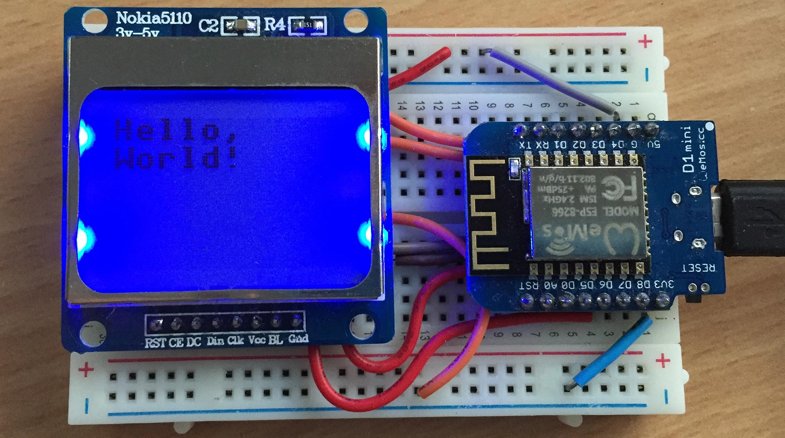

PCD8544
=======

A MicroPython library for the PCD8544 84x48 LCD, used by the Nokia 5110 display.



#### Pinout
```
+-----------------+
|                 |
| +-------------+ |
| | Nokia 5110  | |
| | PCD8544     | |
| | 84x48       | |
| |             | |
| +-------------+ |
+-----------------+
  | | | | | | | |
  1 2 3 4 5 6 7 8
```

* 1 RST
* 2 CE
* 3 DC
* 4 DIN
* 5 CLK
* 6 VCC
* 7 BL
* 8 GND

## Example

Copy the file to your device, using ampy, webrepl or compiling and deploying. eg.

```
$ ampy put pcd8544.py
```

**Hello World**

```
import pcd8544
from machine import Pin, SPI

spi = SPI(1)
spi.init(baudrate=8000000, polarity=0, phase=0)
CE = Pin(2)
DC = Pin(15)
RST = Pin(4)

# backlight on
BL = Pin(12, Pin.OUT, value=1)

lcd = pcd8544.PCD8544(spi, CE, DC, RST)

# test pattern (50% on)
lcd._write_data(bytearray([0x55, 0xAA] * 42 * 6))

# bitmap smiley (horzontal msb)
lcd.clear()
# draw 8x16 in bank 0
lcd.position(0, 0)
lcd._write_data(bytearray(b'\xE0\x38\xE4\x22\xA2\xE1\xE1\x61\xE1\x21\xA2\xE2\xE4\x38\xE0\x00'))
# draw 8x16 in bank 1
lcd.position(0, 1)
lcd._write_data(bytearray(b'\x03\x0C\x10\x21\x21\x41\x48\x48\x48\x49\x25\x21\x10\x0C\x03\x00'))

# toggle display, DDRAM persists image
lcd.power_off()
lcd.power_on()

# nokia logo bitmap
lcd.clear()
lcd._write_data(bytearray(b'\x80\x00\x00\x80\x00\x00\x80\x00\x00\x80\x00\x00\x80\x00\x00\x80\x00\x00\x80\x80\x40\x40\x40\x80\x80\xC0\xC0\x40\xC0\xA0\xE0\xC0\xE0\xE0\xF0\xF0\xF8\xF8\xF8\xFC\xFC\xFE\xEE\xF4\xF0\xF0\x70\x30\x00\x80\x00\x00\x80\x00\x0C\x9C\x1C\x38\xB8\x38\x38\xB8\xF8\xF0\xF0\xF0\xF0\xF0\xF0\xF0\xF0\xF0\xF0\xF0\xF0\xF0\xF0\xF0\xF0\xF0\xF8\xF8\xF8\xF8\x88\x20\x8A\x20\x08\x22\x08\x00\x0A\x00\x00\x02\x80\x71\xBA\xDA\xFD\xDD\xED\xDE\xEE\xF7\xFF\xFB\xFD\xFD\xFE\xFF\x7F\x3F\x1F\x9F\x3F\x7F\x6F\x0F\xAF\x1F\xBF\x3E\x3C\x7A\x78\x70\x22\x88\xA0\x2A\x80\x08\x62\xE0\xE0\xF2\xF0\x58\xDA\xF8\xFC\x92\xFE\xFF\xFF\xD3\xFF\xFD\xF3\xE1\xF0\xF9\x7F\xBF\x3F\x8F\x2F\x4F\xAF\x0F\x4F\xA7\x0F\xAF\x87\x2F\x82\x80\x20\xC0\x80\x80\x50\x40\xC4\xD0\xA0\xE8\xE4\xEA\xFF\xFB\xFD\xFF\xFF\xFF\xFF\xFF\xEF\x4F\x27\x53\xA8\x54\x29\x4A\xB5\x82\xAC\xA1\x8A\xB6\x50\x4D\x32\xA4\x4A\xB4\xA9\x4A\x52\xB4\xAA\x45\xA8\xDA\x22\xAC\xD2\x2A\x52\xA8\x52\x4C\xB0\xAD\x43\x5B\xB3\x45\xA8\x5B\xA3\xAB\x55\xA8\x52\x54\xA9\x56\xA8\x45\xBA\xA4\x49\x5A\xA2\x54\xAA\x52\xFE\xFF\xFF\xFE\xFD\xFF\xFF\xFF\xFE\xFF\xFF\xFF\xFF\xFF\xFF\xFF\xFF\xFF\xFF\xFF\xFF\x7F\xFF\xFE\xBF\x7F\xBF\xBF\xFF\xDF\xBF\x5F\xDF\x7F\xDF\x7F\xDF\xAF\x7F\xEE\x8E\xF1\x6E\x99\xF7\x6A\xDD\xB2\x6E\xD5\x7A\xD7\xAC\x75\xDB\x6D\xD5\x7A\xD7\xAC\x7B\xE5\xDE\xA9\x77\xDA\xB5\xEE\x59\xB6\xEB\xDD\xB6\x69\xD6\xBF\xE8\x55\xEF\xB9\xD6\xED\xB5\x5B\xAB\xFF\xFD\xF7\xFF\x01\x01\x01\x01\xE1\xC1\x81\x03\x05\x0F\x1D\x2F\x7E\x01\x00\x01\x01\xFF\xFE\x03\x01\x01\x00\xF1\xF0\xF1\x71\xF1\xF1\xB1\xF1\x01\x01\x01\x03\xFE\xFF\x01\x01\x01\x01\xBE\x1B\x0D\x07\x03\x41\xE1\xF1\xF9\x6D\xFF\xFF\x00\x01\x01\x01\xFF\xFF\xEB\x3E\x0D\x03\x01\x41\x71\x70\x41\x01\x03\x0E\x3B\xEF\xFE\xFB\xEE\x7D\xF7\xFF\xFF\xFF\xFF\xFE\xFF\xF0\xF0\xF0\xF0\xFF\xFF\xFF\xFF\xFE\xFC\xF8\xF0\xF0\xF0\xF0\xF0\xF0\xFF\xFF\xF8\xF0\xF0\xF0\xF1\xF1\xF1\xF1\xF1\xF1\xF1\xF1\xF0\xF0\xF0\xF8\xFF\xFF\xF0\xF0\xF0\xF0\xFF\xFF\xFE\xFC\xF8\xF0\xF0\xF1\xF3\xF7\xFF\xFF\xF0\xF0\xF0\xF0\xFF\xF3\xF0\xF0\xF0\xFC\xFC\xFC\xFC\xFC\xFC\xFC\xFC\xF0\xF0\xF0\xF3\xFF\xFF\xFF\xFF\xFF'))

lcd.invert(True)
lcd.invert(False)

lcd.reset()

# adjust contrast, bias and temp
lcd.contrast(0x1f, pcd8544.BIAS_1_40, pcd8544.TEMP_COEFF_0)
lcd.contrast(0x3f, pcd8544.BIAS_1_48, pcd8544.TEMP_COEFF_0)
lcd.contrast(0x3c, pcd8544.BIAS_1_40, pcd8544.TEMP_COEFF_0)
lcd.contrast(0x42, pcd8544.BIAS_1_48, pcd8544.TEMP_COEFF_0)
lcd.contrast(0x3f, pcd8544.BIAS_1_40, pcd8544.TEMP_COEFF_2)

# use the framebuf
import framebuf
width = 84
height = 48
pages = height // 8
buffer = bytearray(pages * width)
framebuf = framebuf.FrameBuffer1(buffer, width, height)

framebuf.text('Hello', 0, 0, 1)
framebuf.pixel(30, 30, 1)
framebuf.pixel(31, 31, 1)
framebuf.pixel(32, 32, 1)
framebuf.pixel(33, 33, 1)
framebuf.pixel(34, 34, 1)
framebuf.hline(0, 20, 8, 1)
framebuf.vline(30, 8, 8, 1)
framebuf.rect(40, 16, 8, 8, 1)
framebuf.fill_rect(16, 32, 8, 8, 1)

lcd.position(0, 0)
lcd._write_data(buffer)

framebuf.fill(0)
lcd._write_data(buffer)
```

See [pcd8544_examples.py](pcd8544_examples.py) for more.

## Parts

* [WeMos D1 Mini](https://www.aliexpress.com/store/product/D1-mini-Mini-NodeMcu-4M-bytes-Lua-WIFI-Internet-of-Things-development-board-based-ESP8266/1331105_32529101036.html) $4.00 USD
* [Nokia 5110 LCD Display](https://www.aliexpress.com/item/1pcs-High-Quality-84-48-84x48-LCD-Module-White-backlight-adapter-PCB-for-Nokia-5110-for/32609308327.html) $2.00 USD

## Connections

WeMos D1 Mini | PCD8544 LCD
------------- | ----------
D2 (GPIO4)    | 0 RST
D4 (GPIO2)    | 1 CE
D8 (GPIO15)   | 2 DC
D7 (GPIO13)   | 3 Din
D5 (GPIO14)   | 4 Clk
3V3           | 5 Vcc
D6 (GPIO12)   | 6 BL
G             | 7 Gnd

## Links

* [WeMos D1 Mini](https://wiki.wemos.cc/products:d1:d1_mini)
* [micropython.org](http://micropython.org)
* [Adafruit Ampy](https://learn.adafruit.com/micropython-basics-load-files-and-run-code/install-ampy)
* [PCD8544 Datasheet](docs/PCD8544.pdf)
